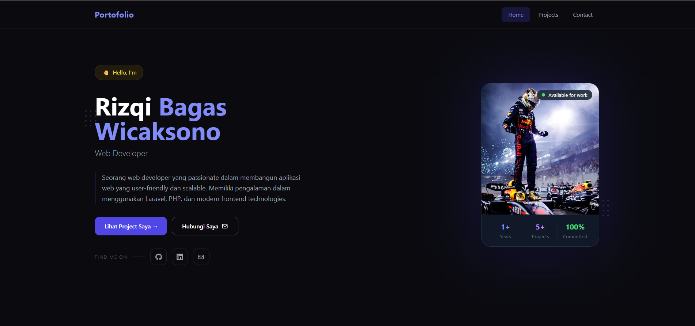
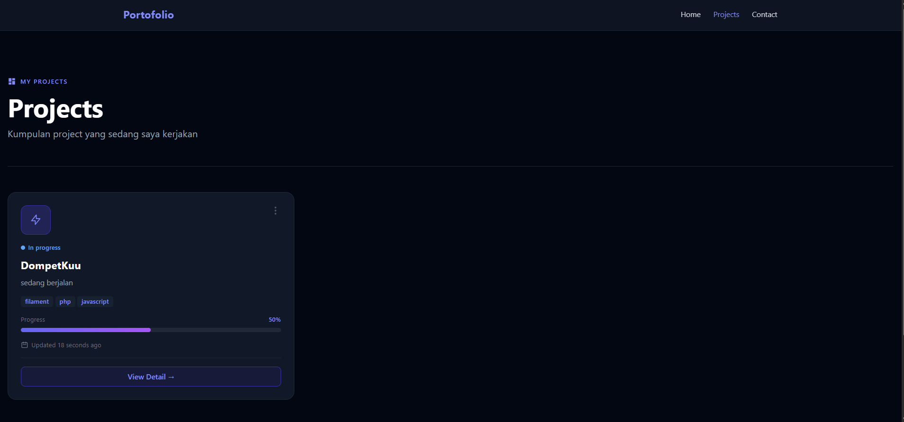
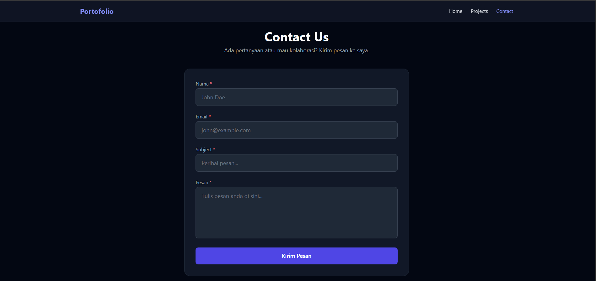
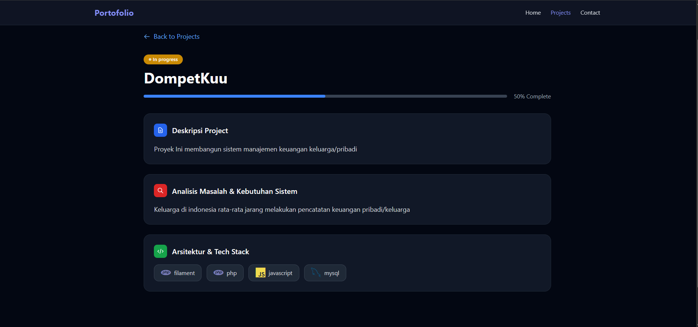

# 🌐 Portfolio Website - Rizqi Bagas Wicaksono

[](LICENSE)
[](https://laravel.com)
[](https://www.php.net)
[](https://www.docker.com)
[](https://github.com/GaassXX/uts-2026)

| Item | Detail |
|------|--------|
| **Nama** | Rizqi Bagas Wicaksono |
| **NIM** | 20240801187 |
| **Mata Kuliah** | Pemrograman Web (CR002) |
| **Dosen Pengampu** | Jefry Sunupurwa Asri, S.Kom., M.Kom |
| **Program Studi** | Teknik Informatika |
| **Universitas** | Universitas Esa Unggul |

---

## 📌 Deskripsi Proyek

Website portfolio personal ini dibuat sebagai tugas UTS mata kuliah Pemrograman Web (CR002). Website ini dirancang untuk memperkenalkan diri sebagai Junior Full Stack Developer sekaligus menampilkan portofolio proyek yang telah dikerjakan. Aplikasi ini dibangun dengan teknologi modern menggunakan Laravel 12, Filament Admin Panel v3, Livewire, Alpine.js, dan Docker.

---

## 📸 Screenshot & Demo

### 🏠 Home Page


### 📂 Projects Page


### 📬 Contact Page


### 🔧 Admin Panel


**🔗 Live Demo:** Jalankan secara lokal menggunakan panduan instalasi di bawah.

---

## 🎯 Tujuan Pembuatan

✅ Memenuhi UTS Pemrograman Web CR002  
🎨 Membangun personal branding sebagai Junior Developer  
📂 Menampilkan portofolio proyek yang telah dikerjakan  
📧 Menyediakan informasi kontak untuk kolaborasi  
🚀 Menerapkan best practices web development modern  

---

## 👤 Profil Pengembang

| Nama Lengkap | Rizqi Bagas Wicaksono |
|--------------|----------------------|
| Panggilan | Rizqi |
| NIM | 20240801187 |
| Role | Junior Full Stack Developer |
| Universitas | Universitas Esa Unggul |
| Program Studi | Teknik Informatika |
| Semester | 4 |

---

## 📍 Kontak

| Platform | Informasi |
|----------|-----------|
| 📧 Email | rizqibagaswicaksonoo@gmail.com |
| 📱 Telepon | - |
| 🛠️ GitHub | [@GaassXX](https://github.com/GaassXX) |
| 💼 LinkedIn | [Rizqi Bagas Wicaksono](https://linkedin.com/in/rizqibagas) |

---

## 🛠️ Tech Stack

### Backend
- **PHP 8.2** dengan Laravel 12
- **Database:** MariaDB 10.4+
- **Admin Panel:** Filament v3
- **ORM:** Eloquent
- **Authorization:** Filament Shield & Spatie Permissions

### Frontend
- **Tailwind CSS** — Styling utility framework
- **Vite** — Build tool & bundler
- **Livewire** — Reactive components tanpa JavaScript
- **Alpine.js** — Interaksi UI ringan
- **Blade Template Engine** — Server-side templating

### DevOps & Infrastructure
- **Docker & Docker Compose** — Container orchestration
- **Nginx** — Web server & reverse proxy
- **PHP 8.2-FPM** — FastCGI processor
- **SSL/TLS** — Support untuk HTTPS

### Testing & Quality
- **Pest PHP** — Testing framework
- **Laravel Pint** — Code style fixer
- **GitHub Actions** — CI/CD Pipeline

---

## 🔑 Fitur Utama

✅ **Responsive Design** — Mobile-friendly dengan hamburger menu  
✅ **Admin Panel** — Filament v3 dashboard untuk kelola semua data  
✅ **Dynamic Portfolio** — Data dari database, kelola via admin  
✅ **Filter Projects** — Filter by status menggunakan Livewire (tanpa refresh)  
✅ **Laporan Project Akhir** — Halaman detail dengan ERD & Flowchart  
✅ **Contact Form** — Real-time validation dengan Livewire + Alpine.js  
✅ **Role & Permission** — Filament Shield  
✅ **Docker Ready** — Siap dijalankan dengan Docker Compose  
✅ **CI/CD Pipeline** — GitHub Actions otomatis cek code quality  

---

## 📋 Kebutuhan Sistem

Pastikan sudah terinstall:

- Docker (versi 20.10+)
- Docker Compose (versi 1.29+)
- Git

---

## 🚀 Panduan Instalasi

### Langkah 1 — Clone Repository
```bash
git clone https://github.com/GaassXX/uts-2026.git
cd uts-2026
```

### Langkah 2 — Setup Environment
```bash
cp src/.env.example src/.env
```

### Langkah 3 — Jalankan Docker
```bash
docker compose up -d
```

### Langkah 4 — Setup Laravel (di dalam container)
```bash
docker exec -it uts_php bash
composer install
php artisan key:generate
php artisan migrate --seed
php artisan storage:link
exit
```

### Langkah 5 — Build Assets
```bash
cd src
npm install && npm run build
cd ..
```

### Langkah 6 — Akses Aplikasi

| URL | Keterangan |
|-----|-----------|
| https://uts.test | Website utama |
| https://uts.test/admin | Admin panel |

### 🔑 Kredensial Login Admin

| Field | Value |
|-------|-------|
| Email | admin@uts.test |
| Password | password |

---

## 📖 Contoh Penggunaan

### Mengelola Profile
1. Buka https://uts.test/admin
2. Login dengan kredensial di atas
3. Klik menu **Profiles** di sidebar
4. Klik **Edit** pada profile yang ada
5. Update nama, tagline, bio, skills, avatar
6. Klik **Save** — perubahan langsung tampil di https://uts.test

### Menambah Project Baru
1. Login ke /admin → klik **Projects** di sidebar
2. Klik tombol **+ Create**
3. Isi judul, deskripsi singkat, pilih status
4. Upload thumbnail (opsional)
5. Isi link GitHub/Demo (opsional)
6. Klik **Save** — project tampil di https://uts.test/projects

### Input Laporan Project Akhir
1. Login ke /admin → klik **Projects**
2. Klik **+ Create** atau **Edit** project yang ada
3. Centang toggle "Ini adalah Project Akhir (Laporan)?"
4. Isi Analisis Masalah, Kebutuhan Sistem, Tech Stack
5. Upload ERD Diagram & Flowchart
6. Klik **Save** — tampil di https://uts.test/projects/{slug}

### Update Status Project
1. Login ke /admin → **Projects**
2. Klik **Edit** pada project
3. Ubah Status: Planning / On Progress / Completed
4. Klik **Save** — badge status di frontend berubah otomatis

### Melihat Pesan Masuk dari Contact Form
1. Login ke /admin
2. Klik menu **Contacts** di sidebar
3. Semua pesan dari form /contact tampil di sini
4. Klik **View** untuk baca detail pesan

---

## 📁 Struktur Proyek

```
uts-2026/
├── .github/
│   └── workflows/
│       └── ci.yml                 # GitHub Actions CI/CD
├── docker-compose.yml             # Docker configuration
├── README.md                       # Dokumentasi proyek
├── LICENSE                         # MIT License
├── Docs/
│   ├── homepage.png
│   ├── projects.png
│   ├── project-detail.png
│   └── contact.png
├── nginx/                          # Nginx web server config
├── php/                            # PHP-FPM configuration
└── src/                            # Laravel application
    ├── app/
    │   ├── Filament/
    │   ├── Http/Controllers/
    │   ├── Livewire/
    │   └── Models/
    ├── database/
    │   ├── migrations/
    │   └── seeders/
    └── resources/views/
        ├── layouts/
        ├── livewire/
        └── portfolio/
```

---

## 📊 Perintah Database

```bash
# Jalankan migrasi
php artisan migrate

# Migrasi + isi data awal
php artisan migrate --seed

# Reset database
php artisan migrate:fresh --seed

# Rollback
php artisan migrate:rollback
```

---

## 🐛 Troubleshooting

### Port sudah digunakan
```bash
docker compose down
docker compose up -d
```

### Permission storage
```bash
docker exec -it uts_php bash
chown -R www-data:www-data storage bootstrap/cache
```

### Cache issue
```bash
php artisan optimize:clear
```

### CSS tidak tampil
```bash
cd src && npm run build
```

### Menu admin tidak muncul
```bash
php artisan shield:super-admin --user=1
```

---

## 📚 Resources

- [Laravel Documentation](https://laravel.com/docs)
- [Filament Documentation](https://filamentphp.com/docs)
- [Livewire Documentation](https://livewire.laravel.com)
- [Alpine.js Documentation](https://alpinejs.dev)
- [Tailwind CSS](https://tailwindcss.com)
- [Docker Documentation](https://docs.docker.com)

---

## 🤝 Panduan Kontribusi

Kontribusi sangat diterima! Ikuti langkah berikut:

1. Fork repository ini
2. Clone fork kamu:
   ```bash
   git clone https://github.com/username/uts-2026.git
   ```
3. Buat branch baru:
   ```bash
   git checkout -b feat/nama-fitur
   ```
4. Lakukan perubahan dan pastikan code style OK:
   ```bash
   ./vendor/bin/pint
   ```
5. Commit dengan pesan deskriptif:
   ```bash
   git commit -m "feat: tambah fitur X"
   ```
6. Push ke branch:
   ```bash
   git push origin feat/nama-fitur
   ```
7. Buat Pull Request ke branch main

### Konvensi Commit Message

| Prefix | Kegunaan |
|--------|----------|
| feat: | Fitur baru |
| fix: | Perbaikan bug |
| docs: | Update dokumentasi |
| style: | Formatting kode |
| refactor: | Refactoring kode |
| ci: | Konfigurasi CI/CD |

---

## 📄 Lisensi

Proyek ini dilisensikan di bawah MIT License — lihat file LICENSE untuk detail lengkap.

Copyright (c) 2026 Rizqi Bagas Wicaksono

---

## 👨‍💻 Author

**Rizqi Bagas Wicaksono**

📧 Email: rizqibagaswicaksonoo@gmail.com  
📱 Phone: +62 812-3456-7890  
🏫 NIM: 20240801187  
🐙 GitHub: [@GaassXX](https://github.com/GaassXX)  

---

**Last Updated:** Mei 2026 — UTS Pemrograman Web (CR002), Universitas Esa Unggul
